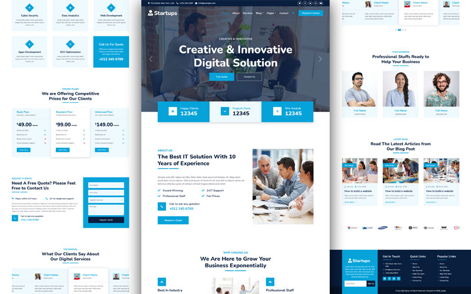

# 🚀 Franatech - Professional IT Services Website Template

<div align="center">



**A modern, responsive HTML template designed specifically for IT services companies, technology firms, and digital agencies.**

[](https://developer.mozilla.org/en-US/docs/Web/HTML)
[](https://developer.mozilla.org/en-US/docs/Web/CSS)
[](https://getbootstrap.com/)
[](https://developer.mozilla.org/en-US/docs/Web/JavaScript)

</div>

---

## 📋 Table of Contents

- [🎯 Overview](#-overview)
- [✨ Key Features](#-key-features)
- [📱 Pages & Sections](#-pages--sections)
- [🛠️ Technologies & Libraries](#️-technologies--libraries)
- [🚀 Quick Start](#-quick-start)
- [📖 Detailed Usage Guide](#-detailed-usage-guide)
- [📁 Project Structure](#-project-structure)
- [🌐 Browser Support](#-browser-support)

---

## 🎯 Overview

**Franatech** is a comprehensive, professional website template specifically crafted for IT services companies, technology firms, and digital agencies. Built with modern web technologies and best practices, it provides a complete solution for establishing a strong online presence.

### 🎨 **Design Philosophy**
- **Professional & Modern**: Clean, corporate design that builds trust
- **User-Centric**: Intuitive navigation and user experience
- **Performance-Optimized**: Fast loading times and smooth animations
- **Mobile-First**: Responsive design that works on all devices

### 🎯 **Target Audience**
- IT Services Companies
- Technology Consulting Firms
- Digital Agencies
- Software Development Companies
- Tech Startups
- Cybersecurity Companies
- Cloud Services Providers

---

## ✨ Key Features

### 🎨 **Visual & Design Features**
- **🎭 Modern UI/UX Design**: Clean, professional interface with smooth animations
- **📱 Fully Responsive**: Optimized for desktop, tablet, and mobile devices
- **🎨 Custom Color Scheme**: Professional blue theme with CSS variables for easy customization
- **🖼️ High-Quality Images**: Placeholder images ready for your content
- **✨ Smooth Animations**: WOW.js animations and CSS transitions
- **🎯 Interactive Elements**: Hover effects, carousels, and dynamic content

### 🚀 **Technical Features**
- **⚡ Fast Loading**: Optimized code and assets for quick page loads
- **🔍 SEO Ready**: Semantic HTML structure and meta tags
- **♿ Accessibility**: WCAG compliant design elements
- **🌐 Cross-Browser**: Compatible with all modern browsers
- **📊 Analytics Ready**: Google Analytics integration points
- **🔧 Easy Customization**: Well-organized code structure

### 🎪 **Interactive Components**
- **🎠 Hero Carousel**: Eye-catching banner with call-to-action buttons
- **📊 Animated Counters**: Statistics that count up on scroll
- **🎭 Testimonial Slider**: Client feedback carousel
- **👥 Team Showcase**: Team members with social media links
- **📝 Contact Forms**: Professional contact and quote forms
- **🔍 Search Modal**: Full-screen search functionality
- **⬆️ Back to Top**: Smooth scroll to top button

---

## 📱 Pages & Sections

### 🏠 **Homepage (`index.html`)**
The main landing page featuring:
- **Hero Carousel**: Dynamic banner with multiple slides
- **Statistics Section**: Animated counters (Happy Clients, Projects Done, Awards)
- **About Preview**: Company overview with key features
- **Services Grid**: 6 IT services with icons and descriptions
- **Pricing Plans**: 3-tier pricing structure (Basic, Standard, Advanced)
- **Quote Section**: Contact form for free quotes
- **Testimonials**: Client feedback carousel
- **Team Preview**: Key team members showcase
- **Blog Preview**: Latest articles
- **Partner Logos**: Vendor/client carousel

### 📖 **About Page (`about.html`)**
Comprehensive company information:
- **Company Story**: Detailed about section
- **Mission & Vision**: Company values and goals
- **Team Members**: Full team showcase with bios
- **Company Statistics**: Key metrics and achievements
- **Why Choose Us**: Unique selling propositions

### 🛠️ **Services Page (`service.html`)**
Detailed service offerings:
- **Service Categories**: Organized service listings
- **Service Details**: In-depth descriptions
- **Process Overview**: How services are delivered
- **Technology Stack**: Tools and technologies used
- **Case Studies**: Success stories and examples

### 📝 **Blog Pages**
- **Blog Grid (`blog.html`)**: Article listing with pagination
- **Blog Detail (`detail.html`)**: Individual article layout with sidebar

### 👥 **Team Page (`team.html`)**
- **Team Grid**: All team members with photos
- **Individual Bios**: Detailed team member information
- **Social Links**: Professional social media connections
- **Skills & Expertise**: Team capabilities showcase

### 💬 **Testimonials (`testimonial.html`)**
- **Client Reviews**: Detailed testimonials
- **Client Photos**: Professional headshots
- **Company Logos**: Client company representations
- **Rating System**: Star ratings and feedback

### 💰 **Pricing (`price.html`)**
- **Pricing Tiers**: Detailed pricing plans
- **Feature Comparison**: Plan comparison table
- **FAQ Section**: Common pricing questions
- **Contact CTA**: Get quote buttons

### ⭐ **Features (`feature.html`)**
- **Feature Showcase**: Key company features
- **Technology Highlights**: Advanced capabilities
- **Process Overview**: Service delivery process
- **Quality Assurance**: Quality standards

### 📞 **Contact (`contact.html`)**
- **Contact Information**: Address, phone, email
- **Contact Form**: Professional inquiry form
- **Map Integration**: Location mapping
- **Business Hours**: Operating schedule

### 📋 **Quote (`quote.html`)**
- **Quote Form**: Detailed project inquiry form
- **Service Selection**: Dropdown service options
- **Project Details**: Scope and requirements
- **Response Promise**: Timeline commitments

---

## 🛠️ Technologies & Libraries

### 🏗️ **Core Technologies**
- **HTML5**: Semantic markup and modern HTML features
- **CSS3**: Advanced styling with Flexbox, Grid, and animations
- **JavaScript (ES6+)**: Modern JavaScript with jQuery integration
- **Bootstrap 5.0.0**: Responsive framework and component library

### 📚 **JavaScript Libraries**
- **jQuery 3.4.1**: DOM manipulation and event handling
- **Owl Carousel 2.3.4**: Touch-enabled carousel/slider functionality
- **WOW.js**: Animation on scroll library
- **CounterUp**: Animated number counting effects
- **Easing.js**: Smooth animation easing functions
- **Waypoints**: Scroll trigger functionality

### 🎨 **Styling & Icons**
- **Font Awesome 5.10.0**: Comprehensive icon library
- **Bootstrap Icons 1.4.1**: Additional icon set
- **Google Fonts**: Nunito and Rubik font families
- **Animate.css**: CSS animation library

### 🌐 **External Dependencies**
- **Bootstrap CDN**: Latest Bootstrap framework
- **jQuery CDN**: JavaScript library
- **Font Awesome CDN**: Icon fonts
- **Google Fonts CDN**: Web fonts

---

## 🚀 Quick Start

### 📥 **Installation**

1. **Download the Template**
   ```bash
   # Option 1: Clone the repository
   git clone [repository-url]
   
   # Option 2: Download ZIP file
   # Extract the downloaded ZIP file to your desired location
   ```

2. **Open in Browser**
   ```bash
   # Simply double-click index.html to open in your default browser
   # OR use a local server for better development experience
   ```

3. **Local Development Server**
   ```bash
   # Using Python (recommended)
   python -m http.server 8000
   # Visit: http://localhost:8000
   
   # Using Node.js
   npx http-server
   # Visit: http://localhost:8080
   
   # Using PHP
   php -S localhost:8000
   # Visit: http://localhost:8000
   ```

---

## 📁 Project Structure

```
franatech-website-template/
├── 📄 index.html              # Homepage with hero carousel and main sections
├── 📄 about.html              # Company information and team details
├── 📄 service.html            # IT services showcase and descriptions
├── 📄 blog.html               # Blog listing with article grid
├── 📄 detail.html             # Individual blog post layout
├── 📄 team.html               # Team members showcase
├── 📄 testimonial.html        # Client testimonials and reviews
├── 📄 price.html              # Pricing plans and packages
├── 📄 feature.html            # Company features and capabilities
├── 📄 quote.html              # Quote request form
├── 📄 contact.html            # Contact information and form
├── 📄 README.md               # This documentation file
├── 📄 LICENSE.txt             # License information
├── 📄 READ-ME.txt             # Original template information
│
├── 📁 css/                    # Stylesheets
│   ├── 📄 bootstrap.min.css   # Bootstrap 5 framework
│   └── 📄 style.css           # Custom template styles
│
├── 📁 js/                     # JavaScript files
│   └── 📄 main.js             # Custom JavaScript functionality
│
├── 📁 img/                    # Images and assets
│   ├── 🖼️ carousel-1.jpg      # Hero carousel images
│   ├── 🖼️ carousel-2.jpg
│   ├── 🖼️ about.jpg           # About section image
│   ├── 🖼️ feature.jpg         # Features section image
│   ├── 🖼️ team-1.jpg          # Team member photos
│   ├── 🖼️ team-2.jpg
│   ├── 🖼️ team-3.jpg
│   ├── 🖼️ blog-1.jpg          # Blog post images
│   ├── 🖼️ blog-2.jpg
│   ├── 🖼️ blog-3.jpg
│   ├── 🖼️ testimonial-1.jpg   # Client testimonial photos
│   ├── 🖼️ testimonial-2.jpg
│   ├── 🖼️ testimonial-3.jpg
│   ├── 🖼️ testimonial-4.jpg
│   ├── 🖼️ vendor-1.jpg        # Partner/client logos
│   ├── 🖼️ vendor-2.jpg
│   ├── 🖼️ vendor-3.jpg
│   ├── 🖼️ vendor-4.jpg
│   ├── 🖼️ vendor-5.jpg
│   ├── 🖼️ vendor-6.jpg
│   ├── 🖼️ vendor-7.jpg
│   ├── 🖼️ vendor-8.jpg
│   └── 🖼️ vendor-9.jpg
│
└── 📁 lib/                    # Third-party libraries
    ├── 📁 animate/            # Animation library
    │   ├── 📄 animate.css
    │   └── 📄 animate.min.css
    ├── 📁 counterup/          # Counter animation
    │   └── 📄 counterup.min.js
    ├── 📁 easing/             # Easing functions
    │   ├── 📄 easing.js
    │   └── 📄 easing.min.js
    ├── 📁 owlcarousel/        # Carousel library
    │   ├── 📁 assets/         # Carousel assets
    │   │   ├── 🖼️ ajax-loader.gif
    │   │   ├── 📄 owl.carousel.css
    │   │   ├── 📄 owl.carousel.min.css
    │   │   ├── 📄 owl.theme.default.css
    │   │   ├── 📄 owl.theme.default.min.css
    │   │   ├── 📄 owl.theme.green.css
    │   │   └── 📄 owl.theme.green.min.css
    │   ├── 📄 LICENSE
    │   ├── 📄 owl.carousel.js
    │   └── 📄 owl.carousel.min.js
    ├── 📁 waypoints/          # Scroll triggers
    │   ├── 📄 links.php
    │   └── 📄 waypoints.min.js
    └── 📁 wow/                # Animation on scroll
        ├── 📄 wow.js
        └── 📄 wow.min.js
```

---

## 🔧 Advanced Features

### 🎭 **Animation System**
The template includes a comprehensive animation system:

- **WOW.js Integration**: Animations trigger on scroll
- **CSS Animations**: Smooth transitions and hover effects
- **Counter Animations**: Numbers count up when visible
- **Carousel Animations**: Smooth slide transitions

### 📱 **Responsive Design**
Mobile-first approach with breakpoints:

- **Mobile**: 320px - 767px
- **Tablet**: 768px - 991px
- **Desktop**: 992px - 1199px
- **Large Desktop**: 1200px+

### 🎨 **CSS Architecture**
Well-organized CSS structure:

```css
/* CSS Custom Properties */
:root {
  --primary: #06a3da;
  --secondary: #34ad54;
  --light: #eef9ff;
  --dark: #091e3e;
}

/* Component-based styling */
.spinner { /* Loading spinner */ }
.btn { /* Button styles */ }
.navbar { /* Navigation */ }
.carousel { /* Carousel components */ }
```

---

## 🌐 Browser Support

### ✅ **Fully Supported**
- **Chrome 90+**: Full feature support
- **Firefox 88+**: Complete compatibility
- **Safari 14+**: All features working
- **Edge 90+**: Full functionality

### 🧪 **Testing Recommendations**
- Test on multiple devices and browsers
- Use browser developer tools for responsive testing
- Validate HTML and CSS for errors
- Check accessibility with screen readers

---

### 📚 **Third-Party Libraries**
- **Bootstrap**: [https://getbootstrap.com](https://getbootstrap.com) - CSS Framework
- **jQuery**: [https://jquery.com](https://jquery.com) - JavaScript Library
- **Owl Carousel**: [https://owlcarousel2.github.io](https://owlcarousel2.github.io) - Carousel Plugin
- **Font Awesome**: [https://fontawesome.com](https://fontawesome.com) - Icon Library
- **Google Fonts**: [https://fonts.google.com](https://fonts.google.com) - Web Fonts
- **WOW.js**: [https://wowjs.uk](https://wowjs.uk) - Animation Library

### 🖼️ **Images & Assets**
- All images are placeholder/demo images
- Replace with your own high-quality, licensed images
- Ensure proper licensing for commercial use
- Consider using stock photo services for professional images

---

### 📞 **Getting Help** [https://github.com/JAM3S11/franatech-website-template/issues] || [jdndirangu2020@gmail.com]

#### **Documentation Resources**
- **Bootstrap Documentation**: [https://getbootstrap.com/docs](https://getbootstrap.com/docs)
- **jQuery Documentation**: [https://api.jquery.com](https://api.jquery.com)
- **Owl Carousel Docs**: [https://owlcarousel2.github.io/OwlCarousel2/docs](https://owlcarousel2.github.io/OwlCarousel2/docs)

#### **Community Support**
- **HTML Codex Support**: [https://htmlcodex.com](https://htmlcodex.com)
- **Bootstrap Community**: [https://github.com/twbs/bootstrap](https://github.com/twbs/bootstrap)
- **Stack Overflow**: Search for specific issues

---

<div align="center">

## 🎉 **Ready to Launch Your IT Services Website?**

**Franatech** provides everything you need to create a professional online presence for your IT services company. With its modern design, comprehensive features, and easy customization options, you can have your website up and running in no time.

### 🚀 **Next Steps**
1. **Download** the template
2. **Customize** with your content
3. **Deploy** to your hosting provider
4. **Launch** your professional website

---

</div>